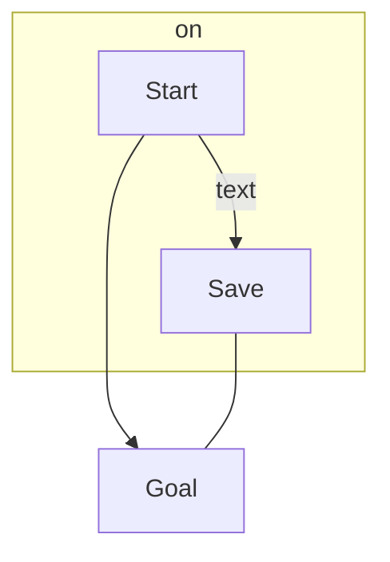
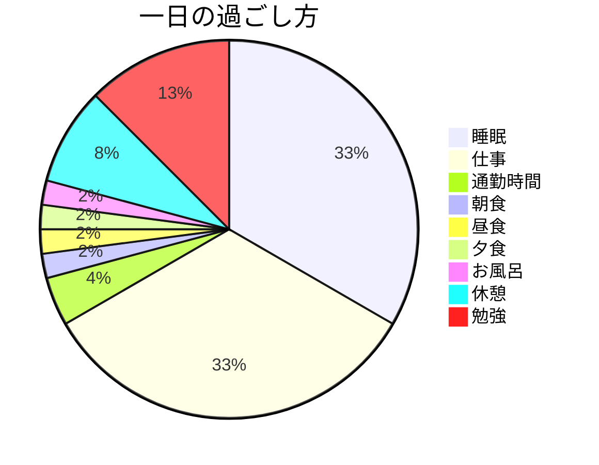

# Mermaidを使ったダイアグラムの記述例
***

## ｛使ってみよう！｝
VScode + Mermaidで作れるのは

**・フローチャート**

**・クラス図**

**・シーケンス図**

**・状態遷移図**

**・ガントチャート**

**・円グラフ**

とのことです。
ガントチャートはツールを使った方が良いと思いますが、場合によります！


## フローチャートのサンプル
例はこんな感じです。
```
flowchart TD
    Start --> Goal
    subgraph on
    Start --> |text|Save
    end
    Save --- Goal
``` 


## 円グラフ
このように円グラフを書けます。

```
pie
    title 一日の過ごし方
    "睡眠" : 8
    "仕事" : 8
    "通勤時間" : 1
    "朝食" : 0.5
    "昼食" : 0.5
    "夕食" : 0.5
    "お風呂" :  0.5
    "休憩" :  2
    "勉強" :  3
```



このようにMermaidだと色々なダイアグラムを作成することができます。