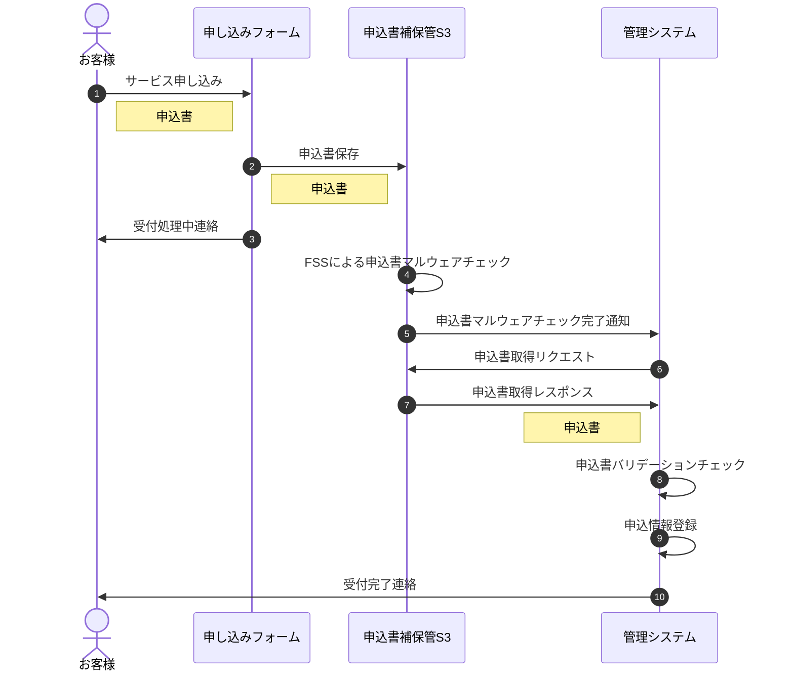
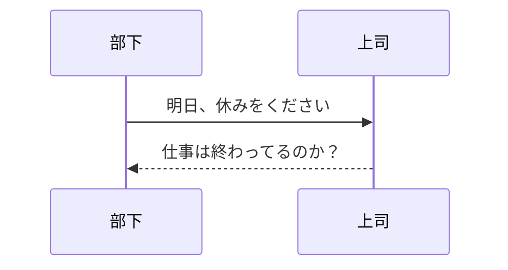

## mermaidで記述できるダイアグラムのチュートリアル
***

今回はシーケンス図のサンプルコードやコツなどを紹介します。



上の図のコードはこちらです
```
sequenceDiagram
    autonumber
    actor お客様
    participant form as 申し込みフォーム
    participant s3 as 申込書補保管S3
    participant admin as 管理システム
    お客様->>form: サービス申し込み
    Note left of form: 申込書
    form->>s3: 申込書保存
    Note left of s3: 申込書
    form->>お客様: 受付処理中連絡
    s3->>s3: FSSによる申込書マルウェアチェック
    s3->>admin: 申込書マルウェアチェック完了通知
    admin->>s3: 申込書取得リクエスト
    s3->>admin: 申込書取得レスポンス
    Note left of admin: 申込書
    admin->>admin: 申込書バリデーションチェック
    admin->>admin: 申込情報登録
    admin->>お客様: 受付完了連絡
```

他の例では、シーケンス図の短いデモで以下の記述で図が作成することができます。



```
sequenceDiagram
    部下->>上司: 明日、休みをください
    %% this is a comment
    上司-->>部下: 仕事は終わってるのか？
```

シンプルなうえ、コードで図を管理することができるのでいろんな場面で役に立つと思います。

## Noteでファイルのやり取りを表現

よくあるファイルの流れはNoteの記述で解決できそうでした。記法とその図は以下のとおりです。

```
sequenceDiagram
    お客様->>form: サービス申し込み
    Note left of form: 申込書
```


```Note```で注釈を追記でき、```[ right of | left of | over ]```でその位置を定義できます。この図ではファイルを受け取る側の、矢印が来る方向に配置するようにしています。どの位置関係がいいかはルールを決めておいたほうが理解しやすそうです。

## 人とシステムは分けて表現する

Mermaidでは何も定義しなければやり取りする対象はプロセスとして四角く囲まれます。明示的に```actor```として定義すると、人の形に変わります。人でないものは```participant```として定義して対象が人なのか分かるようにすると直感的になります。


## actorとparticipantを明確に定義して理想の位置関係にする

上記の続きですが、Mermaidでは```actor```と```participant```は記述した順番に左から右に並ぶようです。
明確に定義しないと登場順に並べられるので、直感的に分かりやすいように位置関係を調整しましょう。
コードで書いてありますから、後からずらすのも簡単です。

## 自動採番はコードで図を管理できるメリット

採番は```autonumber```と1行入れるだけです。自動的に番号を補完してくれるので更新する際も余計な手間がかかりません。


